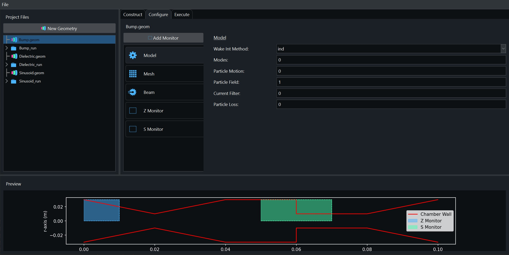

# GECHO

A python based graphical user interface for constructing geometries for use in [ECHO](https://echo4d.de/) simulations.

## Instructions

After installing the required libraries, the GUI can be started by running `driver.py`.

Additionally, on Windows, running `pyinstaller` on `GECHO.spec` produces a standalone executable version of GECHO.

## Acknowledgements

 Igor Zagorodnov for devleoping the ECHO simulation software.
